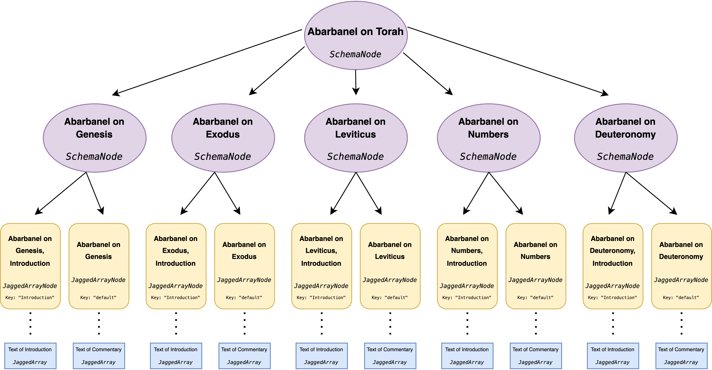
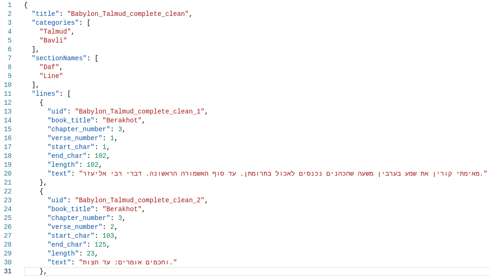
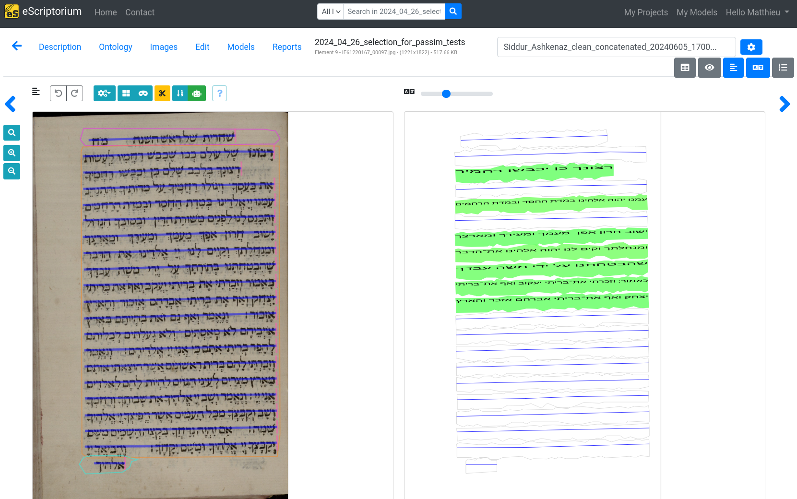
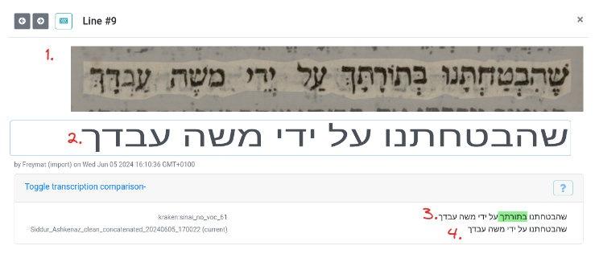
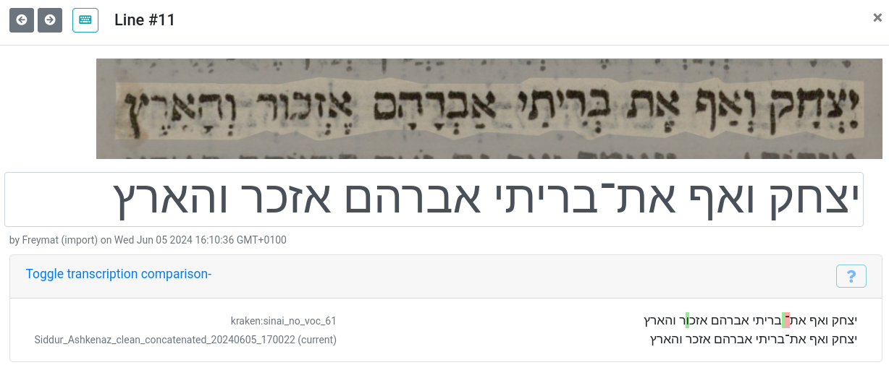
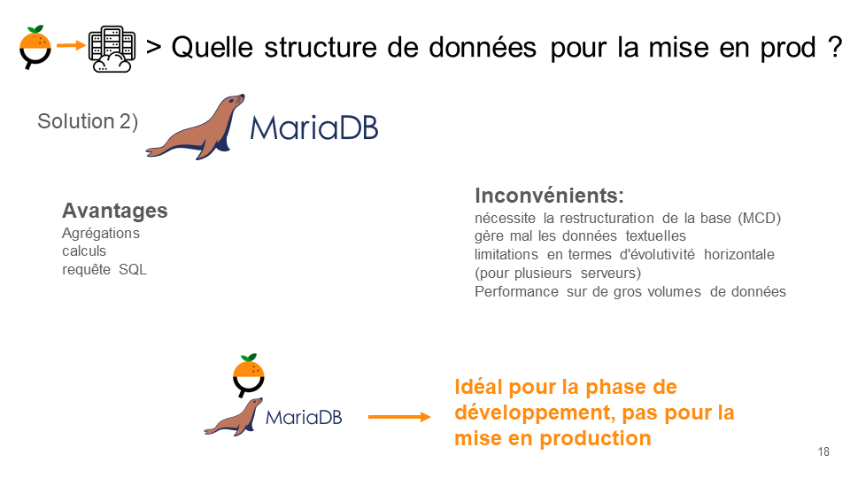
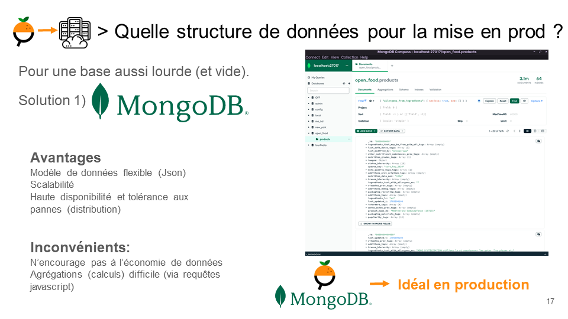

Sélection des pratiques et compétences acquises lors de ma formation en Data Science à l'ICAM Strasbourg-Europe, et lors de mes stages et projets personnels.
[La formation en Data Science à l'ICAM](https://www.icam.fr/formations-professionnelles/formation-data-scientist/) - de l'intégration à l'industrialisation - forme des professionnels capables de répondre aux besoins des entreprises en matière de traitement et d'analyse de données à niveau Master.

# ⛁ Intégration des données

## ⛁ 1. Intégration de la base de données du Répertoire National des Élus (RNE)
### 🎯 Objectifs et conduite du projet 
Dans le cadre du projet 'Intégration de données', j'ai travaillé en équipe de trois, sur la réalisation d'un ETL (Extract, Transform, Load) pour l'intégration de données provenant de différentes tables de la base de données du [Répertoire National des Élus (RNE)](https://www.data.gouv.fr/fr/datasets/repertoire-national-des-elus-1/), 

L'objectif de ce projet était de réaliser l'intégration d'une base de données en vue de **répondre à des requêtes de type SQL**, et de produire des rapports statistiques sur les élus des différentes chambres (municipales, départementales, régionales, etc.) en France, d'étudier la parité au sein des chambres, les nuances politiques des chambres, les mandats cumulés, les élus les plus âgés...

Les difficultés principales résidaient dans la complexité de la base de données, qui était constituée de plusieurs tables non relationnelles (12 tables indépendantes aux informations répétitives), et dans la **nécessité de nettoyer et de transformer les données pour les rendre exploitables**. En effet, les données étaient hétérogènes : les codifications (régions, codes métiers) n'étaient pas uniformes, certaines étant même obsolètes. Les champs de dates n'étaient pas toujours renseignés, et il y avait des erreurs de saisie (dates de naissance, nuances politiques, etc.), ainsi que de nombreux doublons.
Il a fallu mettre en place des procédures de nettoyage et de transformation pour les harmoniser.

Une réflexion de fond a été menée sur la **modélisation des données (MCD)** pour déterminer la meilleure organisation des tables. Deux approches ont été envisagées :

- Une approche centrée sur les chambres : chaque chambre dispose de sa propre table, optimisée en externalisant les libellés. Pour chaque chambre, les élus y sont répertoriés.
- Une approche centrée sur les élus : chaque élu a sa propre table, indiquant dans quelle chambre il détient un mandat.

L'approche "chambres" a été retenue pour sa simplicité, sa facilité de mise en place, d'exploitation et de mise à jour.

Le nettoyage et la structuration des données ont été réalisés à l'aide de l'ETL Talend, qui a permis de mettre en place des procédures de nettoyage, de transformation et de chargement des données.
Les données ont été stockées dans une base de données Oracle, hébergée sur un serveur Linux (Ubuntu). Un serveur Apache, un serveur MariaDB et un serveur PHP ont été utilisés pour la mise en place d'une interface web permettant de consulter les données . Nous avons utilisé l'outil DBeaver et phpMyAdmin pour la gestion de la base de données, et le requêtage SQL pour l'interrogation des données.
Cette solution nous a permis d'accéder à la base de données de façon distante (ssh), de donner un accès à la base de données à l'ensemble de l'équipe et même au jury le jour de la soutenance. Les requêtes ont ainsi pu être exécutées en temps réel.

Nos requêtes SQL ont permis de répondre à des questions telles que :
- Quelle est la répartition des élus par genre ?
- Quels sont les élus les plus âgés, les plus jeunes ?
- Quelles sont les chambres les plus égalitaires, les plus jeunes, les plus âgées ?
- Quelle est la répartition des élus par nuances politiques ?
- D'identifier les élus cumulant le plus de mandats, les mandats les plus cumulés, etc.

Nous avons ainsi créé un outil s'appuyant sur des données publiques, qui permet de répondre à des questions d'intérêt général sur les élus en France, facilement maintenable et évolutif.

La prochaine étape serait la création d'un Dashboard pour la visualisation des données, et la mise en place d'une API pour l'accès aux données. Notre choix se porterait vers une solution Apache Superset, choix cohérent avec notre stack principalement basé sur des technologies open source.

### 🛠️ Moyens et outils
- Modélisation de données (MCD), logiciel de dessin Dia,
- ETL Talend,
- Serveurs Oracle, OS Linux (Ubuntu), Machine virtuelle, SSH,
- SQL, phpMyAdmin, mariaDB, DBeaver.

🔗 Lien vers une présentation du projet: https://github.com/Freymat/ICAM_Projet_Integration_donnees

## ⛁ 2. Nettoyage et préparation des données issues de l'API de Sefaria.org. Stage
### 🎯 Objectifs et conduite du projet

L'objectif de notre stage était la création d'un pipeline de données, permettant la création auto-supervisée de vérité de terrain pour l'entraînement des modèles de reconnaissance optique de caractères (OCR) dans le cadre du projet ERC Synergy MiDRASH (Migrations of Textual and Scribal Traditions via Large-Scale Computational Analysis of Medieval Manuscripts in Hebrew Script).

Le pipeline que nous avons créé (et qui est détaillé dans la partie ***#REF!!!***) recherche des correspondances entre les transcriptions de milliers de manuscrits et imprimés obtenus grâce à des modèles d'OCR (eScriptorium/Kraken) et des centaines de textes historiques complets provenant de l'API de Sefaria.org. Ces correspondances peuvent alors être utilisées comme vérité de terrain pour l'entraînement des modèles d'OCR.

Dans un premier temps, il a fallu collecter un grand nombre de textes complets à partir de l'API de Sefaria.org, un site web mettant à disposition un grand nombre de de textes juifs en hébreu, ainsi que leurs traductions en différentes langues (Tanakh, Talmud, Midrash, etc.)

Une API permet d'accéder à ces textes (https://developers.sefaria.org/).

Les textes y sont disponibles sous forme de fichiers JSON, et proposent différents types de structures:
- structure simple: le texte est architecturé en sections (chapitres), et sous-sections (versets, sous-versets...)
```python
[
  ["Verse 1:1", "Verse 1:2", ...] # Chapter 1
  ["Verse 2:1", "Verse 2:2", ...] # Chapter 2
  [...] 
]
```
- [structure complexe](https://developers.sefaria.org/docs/the-schema-of-a-complex-text), où les sections ne présentent pas toutes la même structure:
```json
{
    "Introduction": ["Intro Paragraph 1", "Intro Paragraph 2", ...],
    "Contents": [
      						["Chapter 1, Section 1", "Chapter 1, Section 2"],
                  ["Chapter 2, Section 1", "Chapter 2, Section 2"], 
                 ...],
    "Conclusion": ["Conclusion Paragraph 1", "Conclusion Paragraph 2", ...]
}
```
La structure de ces textes peut atteindre des degrés de complexité élevés, car en outre du texte, ils contiennent par exemple des commentaires:



*Structure du livre d'Abarbanel sur la Torah (https://developers.sefaria.org/docs/the-schema-of-a-complex-text)*

Nous avons donc mis en place un script Python pour télécharger ces textes automatiquement, les nettoyer, les concaténer, les indexer, et les préparer pour leur utilisation comme vérité de terrain.

Le défi principal était de produire un code permettant de s'adapter à tous les types de structure afin de pouvoir parcourir les textes de manière automatique.
Nous avons mis en place des modules de nettoyage des textes permettant de les normaliser (NFKD), de supprimer les signes diacritiques, de supprimer les balises html résiduelles, de retirer la ponctuation latine, de supprimer les caractères unicodes spéciaux, de supprimer les chiffres arabes...
Les textes ont ensuite été concaténés et enregistrés dans des fichiers texte. Un indexe de chaque texte a été créé afin de pouvoir remonter aux références des versets dans les textes originaux, en connaissant la position du caractère d'un extrait dans le texte complet.



Ce sont plus de 150 textes qui ont été téléchargés, nettoyés, concaténés et indexés., prêts à être utilisés comme vérité de terrain pour la recherche algorithmique d'alignement avec les résultats de l'OCR des manuscrits et imprimés. Ce travail est présenté ci-dessous (***###REF***)


### 🛠️ Moyens et outils
- Python, Jupyter notebook, environnement virtuel (conda),
- API Sefaria.org
- Bibliothèques Python requests, unicodedata, beautifulsoup, json

🔗 Ce travail est disponible sur le dépôt github: 
https://github.com/Freymat/from_Sefaria_to_Passim


# 🔎 Analyse des données
- Python
- statistiques
- ML

## 🔎 1. Création auto-supervisée de vérité de terrain par méthodes algorithmiques

### 🎯 Objectifs et conduite du projet
L'objectif premier de mon stage consistait à mettre en place un pipeline permettant la production de grandes quantités de vérité de terrain pour l'entraînement des modèles de reconnaissance optique de caractères (OCR) dans le cadre du projet ERC Synergy MiDRASH (Migrations of Textual and Scribal Traditions via Large-Scale Computational Analysis of Medieval Manuscripts in Hebrew Script).

Pour entraîner les modèles d'OCR, il est nécessaire de disposer de vérité de terrain, c'est-à-dire de transcriptions manuelles des textes à reconnaître. Ces transcriptions peuvent être obtenues par saisie manuelle, mais cela est très coûteux en temps et en ressources humaines.

Nous avons donc mis en place un pipeline de production de vérité de terrain auto-supervisée, qui permet de comparer les transcriptions obtenues par les modèles d'OCR (obtenus grâce aux outils Kraken et eScriptorium) avec des textes complets provenant de l'API de Sefaria.org, et d'en extraire des correspondances. Ces correspondances peuvent alors être utilisées comme vérité de terrain pour l'entraînement des modèles d'OCR.

eScriptorium est une plateforme en ligne de gestion de manuscrits et de documents anciens, [développée par l'École Pratique des Hautes Études (EPHE)](https://classics-at.chs.harvard.edu/classics18-stokes-kiessling-stokl-ben-ezra-tissot-gargem/). Il est basé sur le logiciel de reconnaissance optique de caractères (OCR) Kraken, qui utilise des réseaux de neurones pour la reconnaissance de caractères s'adaptant à un très grand nombre de scripts.

Le pipeline que nous avons créé est composé de plusieurs étapes:
1) Collecte des transcriptions des manuscrits et imprimés obtenues par les modèles d'OCR (eScriptorium/Kraken).
2) Recherche des correspondances entre les transcriptions et les témoins numériques (issus de l'API de Sefaria.org) à l'aide de l'outil de détection d'alignements [Passim](https://github.com/dasmiq/passim), développé par développé par David Smith et son équipe dans le but de détecter les cas de réutilisation de texte dans un vaste corpus de journaux américains du XIXe siècle projet "Viral Texts" https://viraltexts.org/.  Cet outil s'appuie sur des techniques de traitement automatique du langage naturel (NLP) pour détecter les alignements entre les textes. Dans un premier temps, les textes sont comparés en les balayant par fenêtre de caractères (tuilage de n-grammes / w-shingling), puis les alignements sont raffinés grâce à l'algorithme de Smith-Waterman.
Cet algorithme parcourt chaque document caractère par caractère et détermine si chaque caractère d'un document correspond à un caractère de l'autre. Des espaces sont insérés là où les caractères ne correspondent pas.
Ci-dessous un exemple d'alignement obtenu par Passim, entre une ligne d'OCR et un témoin numérique. En rouge les caractères qui manquent dans l'OCR, en vert les caractères en trop par rapport au témoin numérique.

Finalement, les alignements retenus sont ceux qui ont un ratio de Levenshtein supérieur à un seuil fixé par l'utilisateur.
3) Extraction des alignements détectés par Passim, et création d'une nouvelle transcription. Pour chaque feuillet de document, les alignements retenus sont intégrés dans un fichier xml alto (Analytical Layout and Text Object), qui permet de stocker les transcriptions et les alignements.
4) Export dans eScriptorium pour la visualisation des alignements, et l'entraînement des modèles.

Outre l'import dans eScriptorium des alignements pour la visualisation et l'entrainement des modèles, nous avons également créé des dataframes de synthèse des alignements permettant d'identifier pour chaque feuillet "océrisé", les meilleurs témoins numériques alignés, ainsi que des dictionnaires contenant les informations sur les alignements (texte, position, score de confiance).
Tous ces outils sont décrits sur le dépôt github du projet: https://github.com/Freymat/from_eScriptorium_to_Passim_and_back

Le pipeline se présente sous la forme d'un script python, qui peut être déployé sur différents types de machines (ordinateurs personnels, clusters de calcul). La procédure d'installation est décrite.  Il a été testé sur des ordinateurs personnels, des machines virtuelles, et des clusters de calcul (cluster de calcul de l'in2p3). Il est actuellement en cours de déploiement sur le cluster de calcul du projet MiDRASH.

Actuellement, nous utilisions le pipeline sur des batchs de 7000 manuscrits que nous croisons avec plus de 150 textes numérique. 

**Travaux pour la suite:**
- Diminuer le temps de calcul lors de la création des fichiers .tsv de synthèse des résultats, en parallélisant le traitement des jsons (avec apache spark par exemple).
- Analyse fine des clusters de lignes alignées successivement, afin d'identifier les erreurs les plus fréquentes du modèle d'OCR (tableau de confusion).


### 🛠️ Moyens et outils
- Python, Jupyter notebook, environnement virtuel (conda)
- outils git et github pour la gestion de version
- eScriptorium/ API eScriptorium, Kraken pour l'OCR des manuscrits et imprimés
- Passim pour la détection d'alignements (NLP/Algorithmes de détection d'alignements)

🔗 Lien vers le code du pipeline ainsi que sa documentation: https://github.com/Freymat/from_eScriptorium_to_Passim_and_back


## 🔎 2. Analyse du contenu de la base de données openfoodfacts.
### 🎯 opérations  et conditions:     
Dans le cadre du projet 'Data Analyst: de l'intégration à l'industrialisation', j'ai travaillé sur l'analyse des données de la base de données Openfoodfacts, étape indispensable à la réalisation de la classification des allergènes dans les produits alimentaires.
Nous détaillons au prochain point (***###REF***) la classification des allergènes dans les produits alimentaires de la base de données Openfoodfacts. Ici nous nous concentrons sur l'analyse des données de la base de données.

Cette partie d'exploration nous a permis d'en comprendre le contenu, la structure et la qualité. Mais surtout de **construire avec la diététicienne nutritionniste** le projet d'application en lui exposant le contenu de la base, et d'en estimer la faisabilité sur la base des données disponibles.

#### Contenu de la Base de Données :

Open Food Facts est une base de données ouverte et collaborative qui contient des informations sur des produits alimentaires du monde entier.
À la date de l'étude (février 2024), la base comprenait 3,069,472 lignes (produits) et 206 colonnes couvrant divers aspects des produits alimentaires, tels que la composition, la provenance, la marque, l'emballage, les catégories, les labels, les additifs, les allergènes, les nutriments, etc.

#### Sources de Données :
Les données proviennent de contributions individuelles via des applications mobiles (Open Food Facts, Yuka, Foodvisor) ainsi que d'institutions telles que le ministère de l'Agriculture des États-Unis (USDA) et l'École polytechnique fédérale de Lausanne (EPFL).
Les ajouts ponctuels et massifs de données de ces deux dernières institutions sont bien visibles dans la base de données.
L'analyse des contributions a révélé une croissance constante jusqu'en 2022, suivie d'une stagnation et d'une légère décroissance depuis 2023.
#### Qualité des Données :

##### Complétion des Données :
Une analyse préliminaire a montré que 50% des colonnes contiennent moins de 1% d'enregistrements complétés.
En moyenne, les lignes de la base de données sont complétées à 20%, ce qui indique un nombre significatif de valeurs manquantes.
Colonnes Clés :
Les colonnes les plus complétées sont celles contenant des informations obligatoires comme le nom, la marque, le code-barres, et le Nutri-Score.
Les colonnes contenant des informations facultatives ou plus complexes à renseigner, telles que les additifs, les allergènes, et les nutriments, sont souvent incomplètes. Par exemple, les allergènes ne sont renseignés que pour 8.06% des produits.

##### Visualisation des Données Manquantes :
Utilisation de la bibliothèque missingno pour visualiser les valeurs manquantes.
Cette visualisation a révélé des lacunes significatives dans la complétion des données. Les graphiques montrent que de nombreuses colonnes sont incomplètes, avec des lignes blanches représentant les valeurs manquantes.

##### Problèmes Structurels :
La base de données présente des duplications de colonnes, par exemple, certaines informations sont présentes sous plusieurs formes (e.g., 'x', 'x_tags', 'x_en').
Certaines lignes sont quasi vides, probablement en raison d'une interruption de la saisie par les utilisateurs.
Les champs 'url' sont lourds et représentent 13% du volume total de la base de données, ce qui pourrait être optimisé pour réduire la taille globale.
#### Optimisation de la Base de Données :
Une réorganisation de la structure de la base de données pourrait améliorer l'efficacité et réduire le volume des données.
Pour une utilisation en SQL, il serait avantageux de subdiviser la base en plusieurs tables regroupées autour d'une table d'identification (id).

#### Conclusion de cette partie:
Pour les besoins de notre projet nous avons du ensuite sélectionner les colonnes pertinentes pour la classification des allergènes, et nettoyer les données pour les rendre exploitables. Cette partie est détaillée dans le point suivant (***###REF***).


### 🛠️ Moyens et outils


- pandas, jupyter notebook, conda
- missingno, matplotlib


🔗 Lien vers une présentation du projet: https://github.com/Freymat/ICAM_Projet_Data_Science

## 🔎 3. Classification d'allergènes dans les produits alimentaires de la base de données openfoodfacts.
Dans le cadre du projet 'Data Scientist: de l'intégration à l'industrialisation'.
Ce travail est exposé en détail dans le repository github du projet: https://github.com/Freymat/ICAM_Projet_Data_Science

### 🎯 Objectifs et conduite du projet
Ce projet individuel a été réalisé en 10 jours dans le cadre de ma formation en Data Science à l'ICAM . L'objectif était la conception d'une application au service de la santé publique, en proposant une idée innovante d’application en lien avec l’alimentation pour l’agence Santé Publique France. À notre disposition, la base de données Openfoodfacts.

Après avoir interviewé une diététicienne nutritionniste afin d'identifier comment une application basée sur les données de la base Openfoodfacts pourrait répondre aux besoins et aux attentes des professionnels de santé, nous avons choisi de travailler sur la classification des allergènes dans les produits alimentaires.
(La partie analyse des données de la base de données Openfoodfacts est décrite ci-dessus ***# REF!!!***).

L'enquête de terrain a orienté nos travaux vers la conception d'un assistant numérique qui servirait de trait d'union entre le professionnel et le patient, facilitant ainsi la mise en œuvre du régime alimentaire prescrit. Selon elle, un tel assistant pourrait offrir deux fonctionnalités principales :

- Scanner un produit alimentaire pour informer le patient sur la manière dont il peut s'intégrer dans le régime prescrit : dans quel repas de la semaine, en quelle quantité, avec quel autre aliment d'accompagnement, et dans quelle recette il peut être consommé ; comment ajuster le programme alimentaire de la semaine pour l'équilibrer en fonction de ce produit.

- Scanner un produit alimentaire pour alerter sur le risque de présence d'un allergène, même si celui-ci n'est pas mentionné sur l'étiquette ou si la composition est rédigée en langue étrangère.

C'est sur ce deuxième point qu'a porté notre travail.

Notre objectif est de concevoir une application capable de prédire la présence d'allergènes dans un produit alimentaire en scannant simplement son code-barre.

L'exploration de la base de données a révélé que les allergènes ne sont renseignés que pour 8,06% des produits, rendant impossible l'utilisation directe de cette colonne 'allergènes' pour informer les patients.

Nous avons donc décidé de tenter de classifier les allergènes en utilisant les autres informations disponibles dans la base de données, comme les ingrédients par exemple.

Pour valider notre approche, nous avons choisi de nous concentrer sur un allergène spécifique : le gluten. Nous avons construit un jeu de données binaire indiquant la présence de gluten : 1 si le gluten est présent dans la liste des allergènes, 0 sinon.

L'objectif était donc d'entraîner un modèle de classification capable de prédire la présence de gluten dans un produit alimentaire à partir de sa liste d'ingrédients.

 Nous avons selectionné trois architectures de classifieurs, de la plus simple à la plus élaborée: un arbre de décision, un perceptron multicouche (MLPClassifier) et des réseaux de neurones récurrents LSTM (uni et bidirectionnels).
 
#### Préparation des données

Nous avons travaillé sur un dataset restreint aux données pertinentes pour notre étude :

Sélection des colonnes se limitant aux ingrédients, catégories d'aliments et allergènes.
Sélection des lignes où la colonne 'allergènes' est renseignée.
Création d'une colonne binaire 'gluten_presence' (1 si gluten présent, 0 sinon).
Le dataset final contient 27 colonnes et :

106 752 lignes pour la classe 1 (gluten présent).
137 276 lignes pour la classe 0 (gluten absent).
Les classes sont relativement équilibrées, ce qui est important pour la conception du classificateur.

Quel que soit le modèle de classification utilisé, le principe reste le même :

- Préparation des données textuelles.
- Séparation des données en ensembles d'entraînement et de test.
- Entraînement du modèle.
- Évaluation du modèle.

#### Résultats des Modèles de Classification

##### Arbre de Décision

Pour utiliser les modèles d'arbre de décision, les données textuelles ont été transformées en données numériques via des techniques de NLP :
- **Nettoyage, tokenisation, et vectorisation** des données textuelles avec `nltk` et `CountVectorizer` de `sklearn`.
- Utilisation des **n-grammes** pour capturer des séquences de mots (ex. : "sans gluten" vs. "gluten free").

Après optimisation des hyperparamètres avec `GridSearchCV`, l'arbre de décision a obtenu un score F1 de **0.87** et un recall de **0.92** pour la classe 0 (absence de gluten).

##### Perceptron Multicouche (MLP Classifier)

En utilisant une méthodologie similaire à celle de l'arbre de décision :
- Le **MLP classifier** a également atteint un score F1 de **0.87** et un recall de **0.91** pour la classe 0.

##### Conclusion pour les Modèles de Classification Simples

- Les résultats sont satisfaisants mais doivent être améliorés pour éviter les **faux négatifs**, dangereux pour les allergiques.
- Les modèles ne gèrent pas bien les séquences de mots, problème partiellement contourné par la création de tokens spécifiques (ex. : "glutenfree").

#### Réseaux de Neurones Récurrents LSTM

Les **LSTM** sont adaptés pour traiter des séquences de mots grâce à leur capacité à mémoriser les informations passées :
- Utilisation d'une **architecture simple** avec une couche d'**embedding**, plusieurs couches **LSTM**, des couches de **dropout**, et une couche **dense** de sortie.
- Test des **couches bidirectionnelles** pour améliorer les résultats.

Résultats des LSTM:

- Les **courbes d’entraînement et de validation** ont montré une bonne capacité de généralisation du modèle sans surapprentissage notable.
- Les résultats sont très satisfaisants avec un **recall** allant jusqu'à **0.94** pour la classe 0.
- Le modèle bidirectionnel a fourni les meilleurs résultats avec un vocabulaire de base de **5000 mots**, ce qui en fait notre modèle préféré.

##### Conclusion Générale

- L'arbre de décision et le perceptron multicouche ont donné des résultats acceptables mais insuffisants pour une mise en production.
- Les réseaux **LSTM** ont montré de meilleures performances, particulièrement le modèle bidirectionnel avec un vocabulaire optimisé.
- De plus, le modèle **LSTM capture mieux les séquences de mots** (ex. : "sans gluten" n'a pas le même sens que "gluten free").

### 🛠️ Moyens et outils
- Machine Learning
- Python, Jupyter notebook, environnement virtuel (conda)
- pandas, matplotlib
- nltk, scikit-learn, tensorflow

🔗 Pour rappel: l'ensemble des travaux est disponible sur le dépôt github du projet (rapport, notebooks, présentation): https://github.com/Freymat/ICAM_Projet_Data_Science

Outils utilisés:

- python, conda
- jupyter notebook, pandas, numpy, nltk, 
- scikit-learn, tensorflow


https://www.kaggle.com/datasets/uciml/default-of-credit-card-clients-dataset
Default of Credit Card Clients Dataset
Default Payments of Credit Card Clients in Taiwan from 2005
Démarche de data story telling


# 📊 Visualisation des données
- techno WEB
- Chatbot, API IBM
- Tableau/PowerBI

## 📊 1. Projet Data Visualisation: Dashboard VOD avec Tableau.
Dans le cadre du projet 'Visualisation des données', j'ai travaillé à la réalisation d'un tableau de bord interactif sur les plateformes de vidéo à la demande (VOD).

 L'objectif était la création d'un dashboard interactif avec le programme Tableau de Salesforce. Après **exploration, nettoyage et intégration**, les données devaient être **visualisées** dans un tableau de bord interactif.

Le dataset qui nous a été fourni était constitué de fichiers .csv, contenant des informations sur les films et séries disponibles sur les plateformes de vidéo à la demande (VOD) Netflix, Amazon Prime Video, Disney+ et Hulu.

J'ai choisi d'utiliser ces données pour créer un tableau de bord permettant à chacun de comparer le contenu des quatre plateformes de vidéo à la demande et de choisir celle qui correspond le mieux à ses préférences.
Plutôt que de submerger l'utilisateur avec une multitude d'indicateurs clés (KPIs), nous avons adopté une approche axée sur la simplicité et la clarté.
Nous avons recherché les indicateurs les plus pertinents pour aider l'utilisateur à prendre une décision éclairée. Le design épuré du tableau de bord a été conçu pour faciliter la prise de décision, en mettant l'accent sur les éléments visuels et interactifs tels que les couleurs et les survols de souris (hoovers).
C'est cette quête de clarté et d'épure qui nous a motivés, et nous espérons y être parvenus au moins en partie.

Lors de la présentation, nous avons mis en oeuvre une **démarche de type 'storytelling'** en présentant l'outil comme **une aide intuitive à la décision**, à destination du grand public.

🔗 Le tableau de bord est disponible en ligne sur le site de Tableau Public :
https://public.tableau.com/app/profile/m.freyder/viz/VOD_17163198511630/Tableaudebord1

Présentation du projet: https://github.com/Freymat/ICAM_Projet_Data_VisualisationD
## 📊 2. Visualisation de données textuelles
La visualisation de données textuelles a été une composante de mon travail lors de mon stage à l'EPHE.
L'objectif des modèles de segmentation et d'OCR est de transformer des images de manuscrits et d'imprimés en texte brut, afin de faciliter leur étude et leur analyse.

Afin d'entraîner les modèles d'OCR, nous avons donc travaillé à la production de grandes quantités de vérité de terrain. Celle-ci est obtenue par comparaison des transcriptions des modèles d'OCR avec des témoins numériques. A différentes étapes du pipeline, il est nécessaire de visualiser les alignements entre les transcriptions et les témoins numériques, afin de vérifier la qualité des résultats et de les corriger si nécessaire.

Nous avons utilisé deux outils principaux pour la visualisation des données textuelles :
- **1) création de dictionnaires (json)** synthétisant les alignements détectés par Passim, pour chaque feuillet de document, et chaque témoin numérique. Ces dictionnaires contiennent les informations sur les alignements (texte, position, score de confiance) et sont utilisables pour l'entraînement des modèles d'OCR.


Dans cet exemple, chaque dictionnaire contient les informations sur une ligne d'OCR identifiée par son id. Il contient notamment le texte de l'OCR, la position du texte dans le document, la valeur du ratio de Levenshtein, et le texte du témoin numérique aligné. On visualise ainsi les différences entre l'OCR (clé `text`) et le témoin numérique (clé `alg_GT`).

- **2) eScriptorium** : la plateforme en ligne eScriptorium permet ce type de visualisation de façon plus 'user-friendly'.
Notre pipeline permet la création de fichiers xml alto, contenant les transcriptions basées sur les alignements détectés par Passim et retenus. Ces fichiers peuvent être importés dans eScriptorium pour la visualisation des alignements, et l'entraînement des modèles.

L'image ci-dessous montre les résultats de l'alignement d'un texte (siddur ashkenaz) sur les les lignes d'OCR d'un manuscrit.
La page de gauche est un scan d'un manuscrit. Le modèle de segmentation a identifié les lignes de texte et les régions de la page. La page de droite visualise la transcription contenant les alignement du Siddur Ashkenaz sur les lignes d'OCR.

7 lignes ont ainsi été alignées. Le contenu de ces lignes est présent sur la page de droite, et sont entourés de vert. Les zones vides correspondent aux lignes non alignées.
Il est possible d'étudier en détail les différences entre l'OCR et l'alignement, en cliquant sur les lignes.



Avec:
1. le scan du manuscrit, avec en surbrillance les polygones de segmentation des lignes de texte.
2. la transcription contenant les alignements du Siddur Ashkenaz sur les lignes d'OCR.
Dans le champ 'Toggle transcription comparison' on peut visualiser les différences entre l'OCR et l'alignement:
3. le contenu de l'OCR
4. le contenu de l'alignement
En vert, les caractères en plus dans dans l'OCR, en rouge les caractères manquants. On voit ainsi que le mot 'בתורתך' est présent dans l'OCR, mais pas dans l'alignement.
Autre exemple: 



**Intérêt de la visualisation des données textuelles**: Visualiser les alignements m'a permis de vérifier les résultats de mon pipeline. En effet, ce pipeline traitant des milliers de pages de documents, il est important de pouvoir vérifier visuellement la qualité de l'alignement, en particulier dans la phase de développement du code.
### 🛠️ Moyens et outils
- Python, xml, json
- eScriptorium, Passim


# 🏭 Industrialisation des données
- RGPD
- Gestion de projet informatique
- 

## 🏭 1. Mise en production d'un pipeline de production auto-supervisée de vérité de terrain 
A l'issue de la phase de développement du pipeline de production de vérité de terrain, nous avons travaillé à sa mise en production.

Après avoir développé le code du pipeline de façon modulaire dans jupyter notebook, nous avons procédé à sa transformation en script python, afin de pouvoir le déployer sur différents types de machines (ordinateurs personnels, clusters de calcul).

Le code a été revu par les pairs (développeur full stack senior), et des tests unitaires ont été réalisés pour vérifier son bon fonctionnement. Nous avons cherché à optimiser le code pour réduire les temps de calcul. L'un des gains les plus conséquents a été obtenu en remplaçant la bibliothèque lxml par des expressions régulières pour le traitement des fichiers xml (insertion des alignements dans les fichiers alto), passant de plusieurs heures à quelques minutes pour le traitement de 900 manuscrits sur un ordinateur personnel.

Les outils de gestion de version git et github ont été utilisés pour la gestion de version du code.

Le pipeline a été déployé sur le cluster de calcul de l'in2p3, sur lequel nous avons opéré des tests grandeur nature.

Notre objectif étant de fournir au projet MiDRASH un outil utile et fonctionnel pour la production de vérité de terrain nous avons veillé à ce que le code soit bien documenté. Le code est disponible sur le dépôt github, avec un guide d'utilisation et une documentation complète.

Enfin, un accompagnement a été dispensée aux autres membres de l'équipe pour leur expliquer le fonctionnement du pipeline et les former à son utilisation.


### 🛠️ Moyens et outils
- calculateurs en environement Linux
- python, Jupyter notebook, environnement virtuel (conda)
- eScriptorium, Kraken, Passim
- git, github

Lien vers le projet (et ses branches de développement) : https://github.com/Freymat/from_eScriptorium_to_Passim_and_back


## 🏭 2. Étude comparative de solutions de bases de données pour la mise en production de notre application à destination des professionnels de santé.

### 🎯 Objectifs et conduite du projet
Dans le cadre du projet 'Data Scientist: de l'intégration à l'industrialisation', nous avons travaillé avec une diététicienne afin de créer un assistant numérique pour l'aide au suivi des régimes alimentaires prescrits aux patients. Ce projet a débouché sur la création d'une application de classification des allergènes dans les produits alimentaires, basée sur les données de la base Openfoodfacts.

Lors de la phase de conception de l'application, nous avons avons anticipé la mise en production de l'application, afin de nous assurer de la faisabilité technique du projet. La base de données Openfoodfacts est-elle adaptée à notre application ? Quelle solution de base de données est la plus adaptée à notre projet ?

En effet la base de données Openfoodfacts est volumineuse (3,069,472 lignes et 206 colonnes en février 2024) nous incitant à réfléchir à la meilleure solution de base de données pour la mise en production de notre application.

Nous avons choisi de comparer les bases de données SQL (MariaDB) et NoSQL (MongoDB) pour la mise en production de notre application fonctionnant avec la base de donnée openfoodfacts.

#### Solution Maria DB (SQL)

Nous avons envisagé de réimporter la base de données sous forme de tables SQL afin de pouvoir la requêter pendant la phase de développement et pourquoi pas de mise en production de notre application. La création de la structure de la table était très fastidieuse en raison du grand nombre de colonnes et de la variété des données. Nous avons du définir de façon précise le type des données de chaque colonne et adapter la longueur des champs pour chaque type de données. Nous avons écris un script python pour la création de la base de données et des tables, et l'import des données grâce à la bibliothèque sqlalchemy (pour la gestion des requêtes SQL de création de la table). Malheureusement, les essais d'import de la base en local ont échoué en raison de la taille de la base impossible à charger en entier. Un important travail de restructuration de la base de données aurait été nécessaire, en la scindant en plusieurs tables, en triant et en nettoyant les données, avec la conception d'un ETL pour la mise à jour régulière des données, ce qui n'était pas envisageable dans le cadre de notre projet.
Cette solution n'a donc pas été retenue, mais nous sommes heureux d'avoir pu explorer cette solution SQL et identifier les avantages et les inconvénients de cette solution.



Nous avons donc ensuite investigué la solution MongoDB.

#### Solution MongoDB (NoSQL)
 La base de données Open Food Facts étant déjà disponible sous forme de dump MongoDB, cette solution a trouvé notre faveur pour plusieurs raisons:
- plus adaptée aux données textuelles que SQL,
- scalabilité et haute disponibilité des bases de données NoSQL,
- toutefois son modèle de données flexible (pas de schéma prédéfini) n'encourage pas à la structuration des données. La base de données souffrant déjà d'un manque de structuration, nous ne pourrons faire l'économie d'un travail de nettoyage et de restructuration de la base en vue de la rendre plus légère.

Afin de tester cette solution, nous avons fait tourner la base de données MongoDB en local sur un système Linux. Nous avons requêté et exploré la base de donnée à l'aide de Compass, l'interface graphique de MongoDB.
C'est cette solution qui a été retenue pour la mise en production future de notre application.



### 🛠️ Moyens et outils
- SQL: serveur Apache, phpMyAdmin, MariaDB, Python, Jupyter Notebook, bibliothèque sqlalchemy
- NoSQL: MongoDB, Compass

Présentation et notebook disponibles sur le dépôt github du projet:
https://github.com/Freymat/ICAM_Projet_Data_Science/tree/main
https://github.com/Freymat/ICAM_Projet_Data_Science/tree/main/working_notebooks

## 🏭 3. Conception d'un chatbot documentaire.
### 🎯 Objectifs et conduite du projet

Dans le cadre du projet IA/Watson de notre formation à l'ICAM, nous avons travaillé sur la conception d'un chatbot documentaire, en utilisant les outils de la plateforme IBM Watson.
Nous avons appliqué cet outil à une usine de fabrication de roulements à bille.

Le chatbot avait pour rôle principal de guider les collaborateurs d'une entreprise sur leur intranet (authentification, ouverture de tickets en cas de problèmes informatiques, etc.). En connectant le chatbot à la base de données documentaire de l'entreprise, nous avons facilité l'accès des collaborateurs aux informations nécessaires via des questions simples posées au chatbot.

Le chatbot a ainsi été connecté à une base de données documentaire factice contenant:
- Données techniques sur les produits de l'entreprise : Types de roulements à bille, leurs caractéristiques.
- Procédures de fabrication : Normes de qualité, certifications.
- Procédures de maintenance : Pièces détachées, garanties.
- Procédures de recyclage, normes environnementales.
- Informations sur l'entreprise : Annuaire des collaborateurs, organigramme.

Ayant constaté que les documents produits lors des différentes étapes d'un projet sont rarement exploités (rapports finaux, retours d'expérience), nous avons conçu ce chatbot documentaire pour faciliter l'accès à ces documents archivés, en vue de leur réutilisation dans de futurs projets.

Exemple de questions que nous pouvons poser à notre chatbot documentaire (la documentation est en anglais) :
	 	 	 	
**Retours d'expérience:**
"Where was the last Experience Feedback Meeting held?"
"What are the lessons learned?"
"What problems were encountered?"

**Question sur projets en cours:**
"What is the start date of project ‘Design of the Latest Brand Ball Bearing’?"
"What are the project constraints?"

**Questions sur un produit:**
"What are the Product Specifications of the Innovative Ball Bearing – BX100?"
"What are the dimensions of the BX100?"
"What are the use cases of the BX100?"
"What is the warranty period of the BX100?"

**Annuaire / Organigramme :**
"Who is the Head of the Research and Development Department?"
"Who are the members of the Research and Development Department?"
"What is the phone number of the Head of the Research and Development Department?"
"In which building/office is Mr. John Doe located?"

Ce projet a fait l'objet d'une présentation et d'une démo live lors de la soutenance finale du projet IA/Watson.

### 🛠️ Moyens et outils
Nous avons utilisé la plateforme IBM Watson X :

- Watson Assistant : Pour la création du chatbot.
- Watson Discovery : Pour l'indexation et la recherche des documents.


